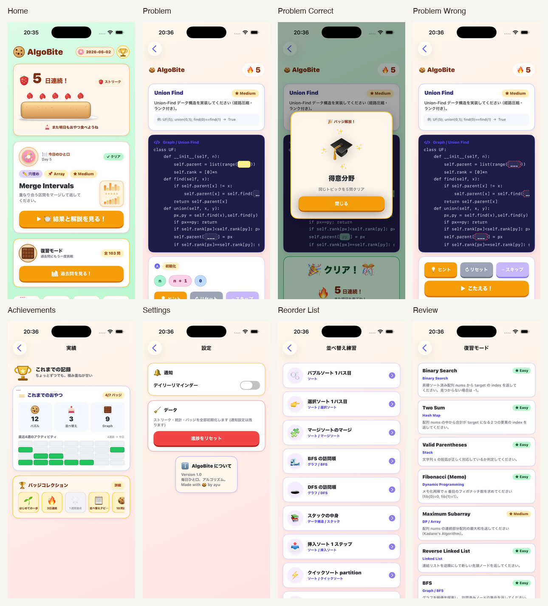
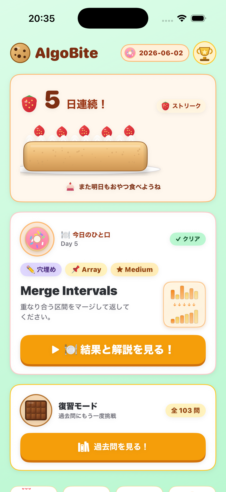
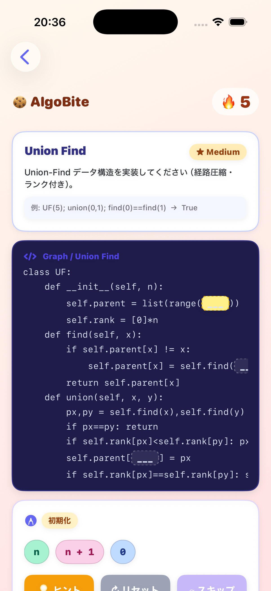
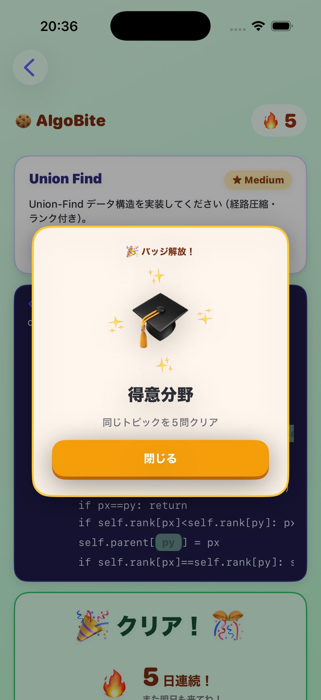
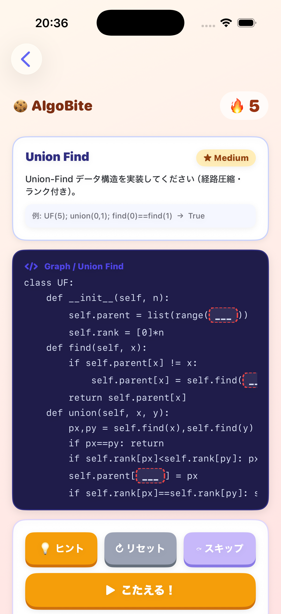
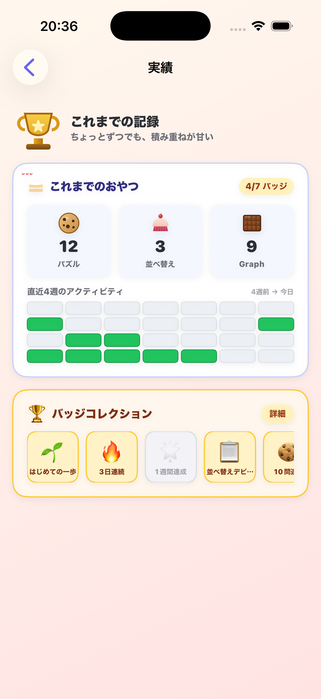
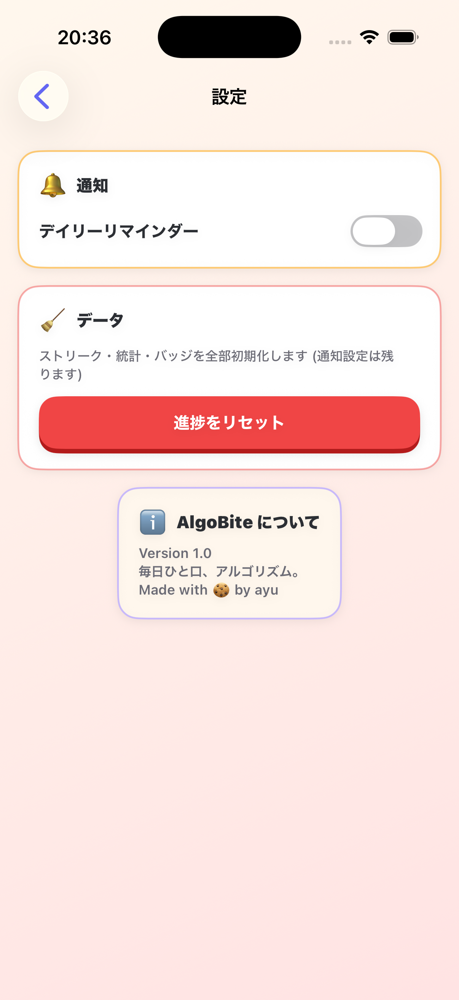
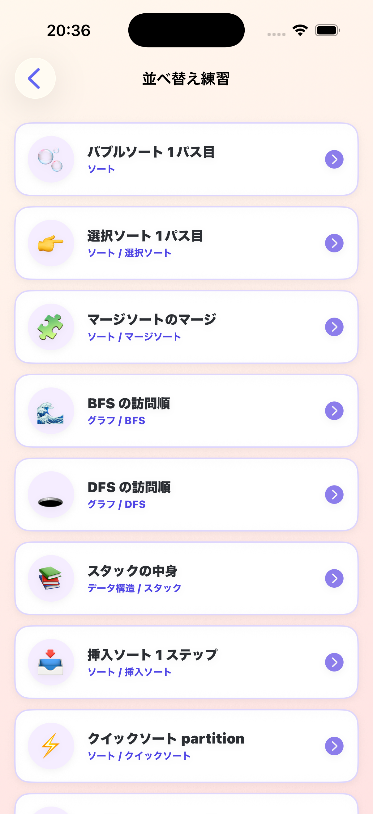
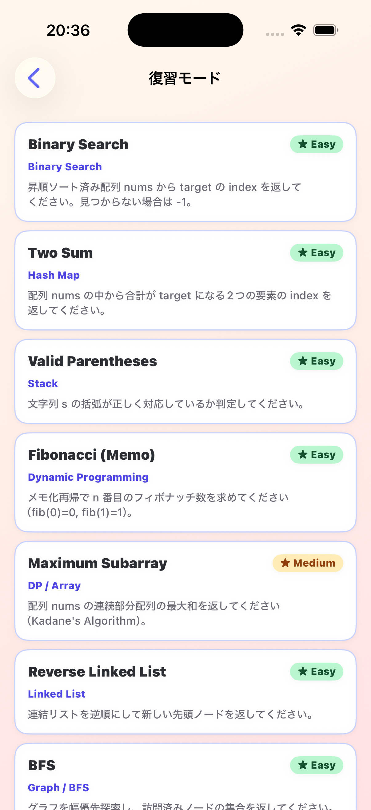

# AlgoBite

毎日ひと口ずつ、アルゴリズムとデータ構造を学ぶための iOS アプリです。

コードの穴埋めパズルと処理順の並べ替えクイズを解き、クリア後のアニメーションでアルゴリズムの動きを視覚的に確認できます。



## Features

- **今日のひと口**
  - 穴埋めパズルと並べ替えクイズを `3:1` の割合で日替わり出題
  - 全 134 問をローテーション
- **コード穴埋めパズル**
  - 103 問収録（Easy 40 / Medium 49 / Hard 14）
  - コード中のスロットを選び、候補から回答
  - 不正解箇所のシェイク + 赤波線表示と再挑戦
  - テキストヒント → 1 スロット自動入力の 2 段階ヒント
- **並べ替えクイズ**
  - 31 問収録（26 トピック、一部トピックは複数問あり）
  - LCS（最長共通部分列）で正しい並びのブロックを残し、誤ったブロックのみプールに戻す
- **アルゴリズムアニメーション**
  - 穴埋めパズル・並べ替えクイズともにクリア後に解説とアニメーションを表示
  - DP・ソート・グラフ・木・文字列・連結リスト・スタックなど 103 パターンを SwiftUI で可視化
  - 並べ替えクイズは日本語トピック名から自動選択（全 26 トピック対応済み）
- **継続と振り返り**
  - ロールケーキといちごで連続学習日数を表示
  - ストリークに影響しない復習モード
  - 28 日間の活動ヒートマップとトピック別統計
  - 7 種類のバッジ（初クリア / 連続日数 / 累計問題数など）
- **通知と Widget**
  - 時刻を指定できるデイリーリマインダー
  - ストリークと当日のクリア状況を表示する Small / Medium Widget
- **その他**
  - オンボーディング / 結果共有 / ダークモード / 進捗リセット

## Screens

| Home | Problem | Correct | Wrong |
| --- | --- | --- | --- |
|  |  |  |  |

| Achievements | Settings | Reorder | Review |
| --- | --- | --- | --- |
|  |  |  |  |

## Tech Stack

- Swift / SwiftUI
- Charts
- WidgetKit
- UserNotifications
- MVVM
- UserDefaults / App Group
- iOS 17+

外部パッケージには依存していません。

## Requirements

- macOS
- Xcode（iOS 17 SDK を利用できるバージョン）
- iOS 17 以降の実機または Simulator
- Apple Developer Team

## Getting Started

```bash
git clone git@github.com:sweetFish8/AlgoBite.git
cd AlgoBite
open AlgoBite.xcodeproj
```

Xcode で次の設定を確認してから `AlgoBite` scheme を実行してください。

1. `AlgoBite` と `AlgoBiteWidget` の Signing Team を設定する
2. 両ターゲットの Bundle Identifier を自分の環境で一意な値にする
3. 両ターゲットで同じ App Group を有効にする（`group.group.app.Goto.Sakana.AlgoBite`）
4. App Group の識別子をアプリ側・Widget 側の entitlements および共有 UserDefaults で一致させる

コマンドラインでのビルド確認:

```bash
xcodebuild \
  -project AlgoBite.xcodeproj \
  -scheme AlgoBite \
  -configuration Debug \
  -destination 'generic/platform=iOS Simulator' \
  build
```

## Project Structure

```text
AlgoBite/
├── AlgoBiteApp.swift              # エントリポイント
├── ContentView.swift              # NavigationStack と全画面
├── GameViewModel.swift            # 今日のチャレンジ・進行状態・ストリーク
├── Models.swift                   # PuzzleProblem / PuzzleSlot モデル
├── AppTypes.swift                 # AppScreen / DailyChallenge など
├── Problems.swift                 # 穴埋めパズル 103 問のデータ
├── ReorderQuiz.swift              # 並べ替えクイズ UI と LCS 判定
├── ExplanationView.swift          # 解説 + アニメーション画面
├── TopicAnimations.swift          # アニメーションのルーティング
├── BuiltInAnimations.swift        # 汎用アニメーション（Binary Search など）
├── Animations_DP.swift
├── Animations_Sorting.swift
├── Animations_Graph.swift
├── Animations_Tree.swift
├── Animations_LinkedList.swift
├── Animations_Stack.swift
├── Animations_String.swift
├── Animations_Math.swift
├── Animations_Misc.swift
├── PopStyle.swift                 # デザインシステム
├── DebugCapture.swift             # デバッグ補助（#if DEBUG のみ）
└── Extras/
    ├── ReorderQuizData.swift      # 並べ替えクイズ 31 問のデータ
    ├── ReorderQuizList.swift      # 並べ替え一覧画面
    ├── StatsStore.swift           # 学習統計
    ├── Badges.swift               # バッジ定義とアンロック判定
    ├── HintStore.swift            # ヒントテキスト
    ├── ReviewMode.swift           # 復習モード
    ├── OnboardingView.swift
    ├── AchievementsView.swift
    ├── SettingsView.swift
    ├── AppNotifications.swift
    └── ...

AlgoBiteWidget/
├── AlgoBiteWidget.swift
└── AlgoBiteWidgetBundle.swift
```

## Data and Progress

学習状況は App Group の UserDefaults に保存されます。

- ストリークと最終クリア日
- 当日の回答・正誤・試行回数
- 累計クリア数 / トピック別クリア数 / 活動日一覧
- バッジ解除状況
- 通知設定

設定画面の「進捗をリセット」では、通知設定を残して学習データを初期化します。

## Debug

Debug ビルドでは `todayChallenge` が常に **Climbing Stairs**（`climbing-stairs`）を返すよう固定されます。  
問題を変更したい場合は `DebugCapture.pinnedProblemID` を書き換えてください。

`-captureMode` フラグを使うと、さらに詳細な起動引数で画面状態を再現できます。

```bash
xcrun simctl launch booted <bundle-id> \
  -captureMode \
  -nav problem \
  -selectSlot first
```

| フラグ | 内容 |
| --- | --- |
| `-captureMode` | オンボーディング・通知ダイアログをスキップ、撮影用データを投入 |
| `-nav problem` | 問題画面へ直接遷移 |
| `-nav achievements` | 実績画面へ直接遷移 |
| `-nav settings` | 設定画面へ直接遷移 |
| `-nav reorderList` | 並べ替え一覧へ直接遷移 |
| `-nav review` | 復習一覧へ直接遷移 |
| `-selectSlot first` | 最初のスロットを選択状態にする |
| `-autoplay correct` | 全スロットに正解を自動入力して採点 |
| `-autoplay wrong` | 全スロットに不正解を自動入力して採点 |
| `-freshBadges` | バッジ・統計をリセット（バッジ解除演出撮影用） |

これらの処理はすべて `#if DEBUG` 内にあり、Release ビルドには含まれません。

## App Store Screenshots

Simulator 撮影から App Store 提出用 ZIP 生成までを自動化しています。

```bash
# 初回セットアップ
./scripts/app-store-screenshots.sh setup

# 撮影 → ZIP エクスポートを一括実行
./scripts/app-store-screenshots.sh all

# エディタをブラウザで開いて文言・レイアウトを調整
./scripts/app-store-screenshots.sh edit
```

| コマンド | 内容 |
| --- | --- |
| `setup` | npm install + Playwright Chromium のインストール |
| `capture` | iPhone 17 Pro シミュレータで 6 画面を自動撮影 |
| `edit` | Next.js エディタを localhost で起動 |
| `export` | Playwright でヘッドレス ZIP エクスポート |
| `all` | capture + export を一括実行 |

生成したスクショは `store-screenshots/public/screenshots/apple/iphone/ja/`、  
ZIP は `store-screenshots/exports/` に保存されます。

## Spec

詳細な仕様は [`AlgoBite_Spec.md`](AlgoBite_Spec.md) を参照してください。
